# QUICKSTART: авторизация в Google

skrepka работает от **вашего** имени через **ваш** проект Google Cloud и **ваш**
OAuth-клиент. Готового «войти через Google» здесь нет и не будет — почему так и что это
значит для ваших данных, честно объяснено в [PRIVACY.md](../PRIVACY.md). Один раз это
занимает 15–30 минут; дальше `skrepka` работает без повторной настройки.

Мастер `skrepka init` не может пройти эти шаги за вас: для этого понадобился бы доступ к
управлению вашим Google-проектом, который skrepka намеренно никогда не запрашивает. Он
показывает те же шаги с прямыми ссылками и проверяет результат.

## Что понадобится

- Аккаунт Google (личный Gmail подойдёт).
- Браузер и терминал.
- ~15–30 минут на первую настройку.

**Замечание.** Google периодически меняет консоль, поэтому кнопки могут стоять чуть иначе,
чем на снимках. Общий порядок остаётся тем же.

## Шаг 1. Создать проект Google Cloud

Откройте <https://console.cloud.google.com/projectcreate>, задайте имя проекта (любое,
например `Skrepka`) и нажмите **Create**. Затем **выберите этот проект** в переключателе
вверху страницы — все следующие шаги должны идти в нём.

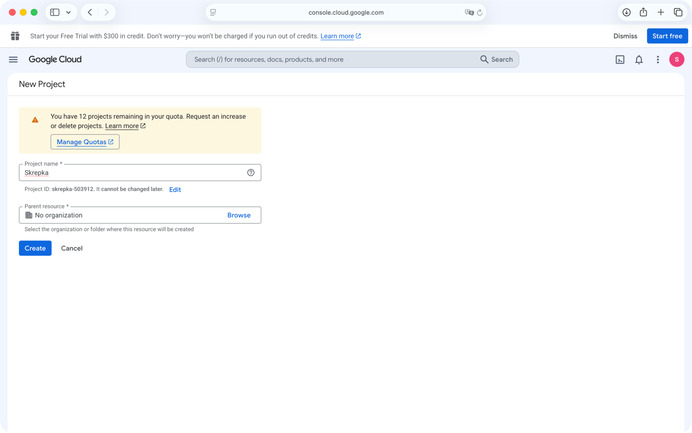

## Шаг 2. Включить Google Docs API

Откройте <https://console.cloud.google.com/apis/library/docs.googleapis.com> и нажмите
**Enable**.

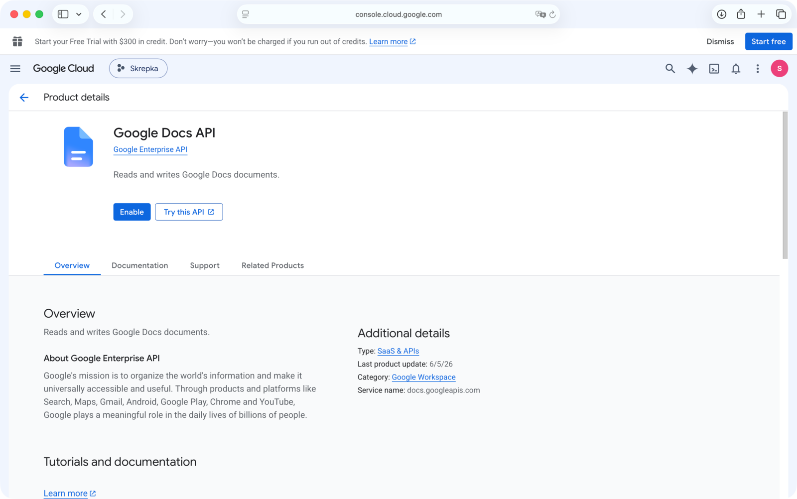

## Шаг 3. Включить Google Drive API

Откройте <https://console.cloud.google.com/apis/library/drive.googleapis.com> и нажмите
**Enable**.

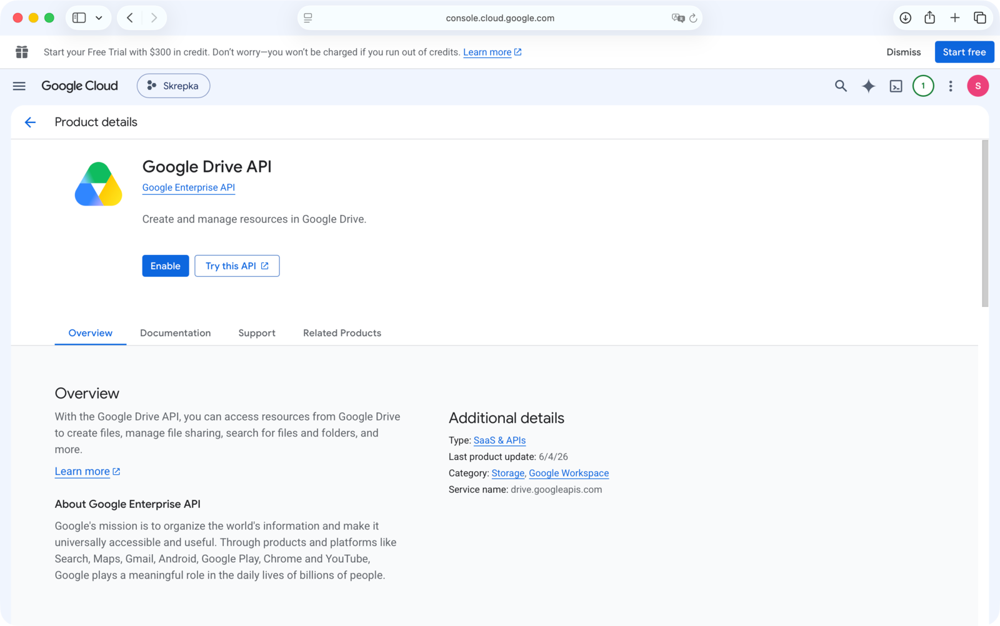

**Важно про доступ.** Включить API — это разрешить проекту **обращаться** к службе, а не
выдать доступ к вашим файлам. Сам доступ вы дадите ниже одним пунктом. Обе службы нужны:
к Docs — для текста документа, к Drive — для комментариев и файлов; при этом одного
разрешения `drive` хватает для обеих.

## Шаг 4. Настроить экран согласия и доступ

Откройте <https://console.cloud.google.com/auth/overview> (проверьте, что вверху выбран
ваш проект).

### 4.1. Пройти мастер «Get started»

На новом проекте платформа ещё не настроена — нажмите **Get started**.

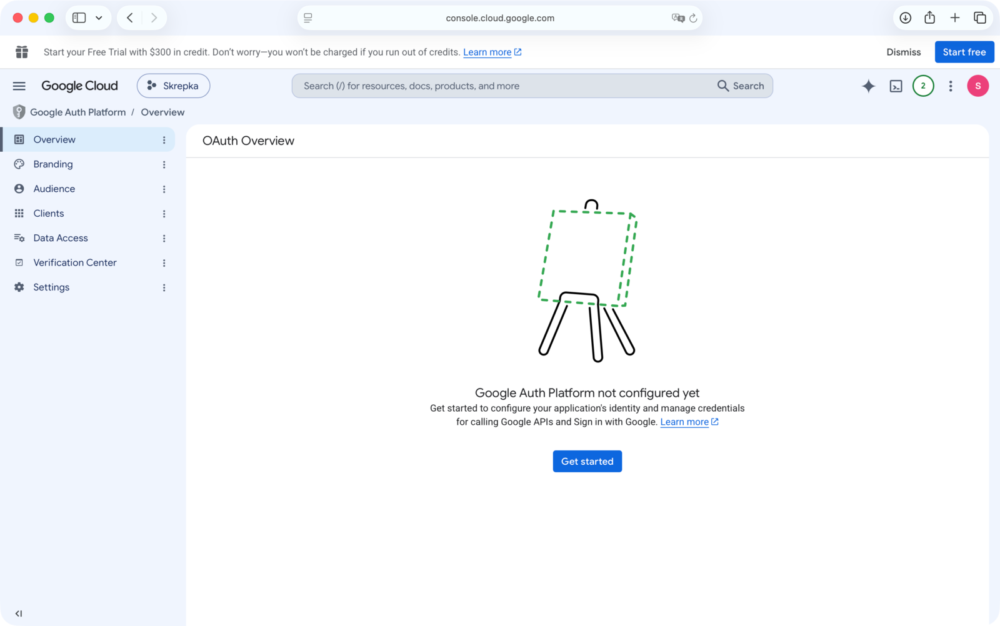

Мастер проведёт через несколько коротких экранов:

- **App Information.** App name — любое (например `Skrepka`; это имя увидите на экране
  согласия при входе). User support email — ваш адрес.
- **Audience.** Выберите **External** — единственный вариант для личного Gmail.

  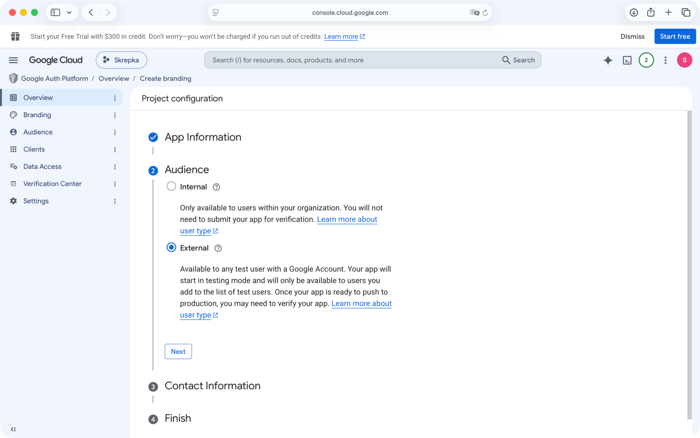

- **Contact Information.** Ваш email для уведомлений Google о проекте.
- **Finish.** Поставьте галочку согласия с политикой и нажмите **Continue** → **Create**.

  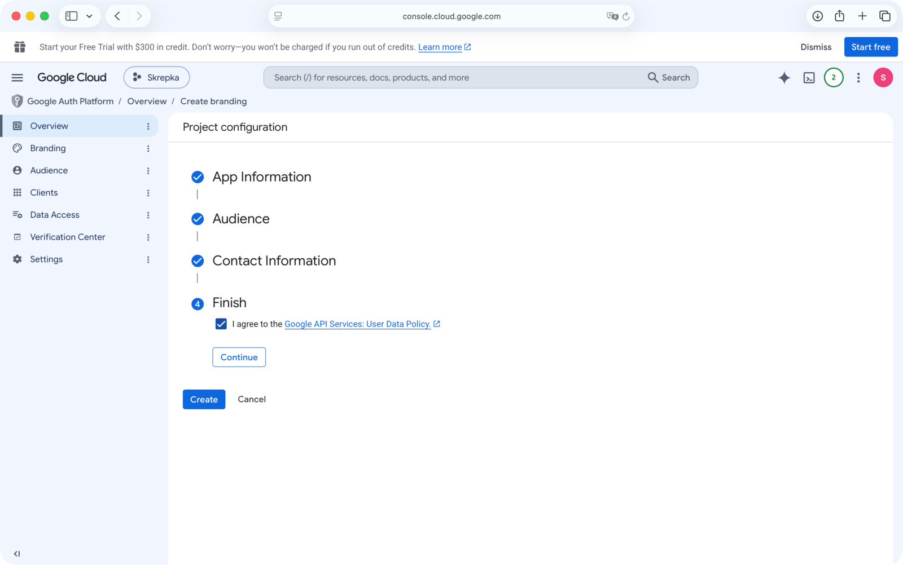

### 4.2. Добавить один доступ (scope)

Слева откройте вкладку **Data Access** → **Add or remove scopes**. В поле
**«Manually add scopes»** вставьте **ровно один** scope, нажмите **Add to table**, затем
**Update**:

```
https://www.googleapis.com/auth/drive
```

Больше ничего не добавляйте: одного `drive` достаточно и для работы с документами, и для
комментариев. Более узкий `drive.file` не подходит — он ломает работу с чужим документом
по ссылке.

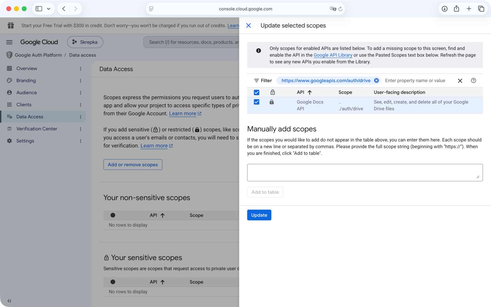

Появится окно **«Verification required»** — просто нажмите **Continue**. Поля про
justification, demo-видео и предложение отправить приложение на проверку (verification)
**заполнять и отправлять не нужно**: для личного использования проверка Google не
требуется (см. 4.4).

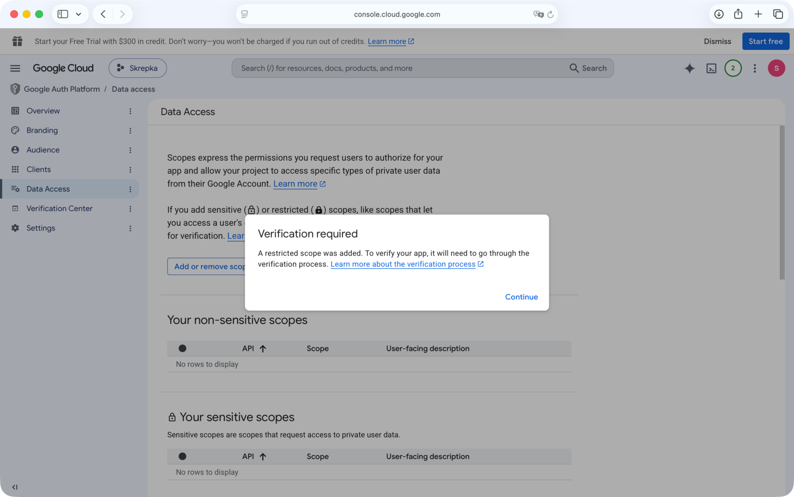

### 4.3. Опубликовать приложение (Publish app)

Слева откройте **Audience**. Если Publishing status = **Testing**, нажмите **Publish app**
и подтвердите **Confirm** в окне «Push to production».

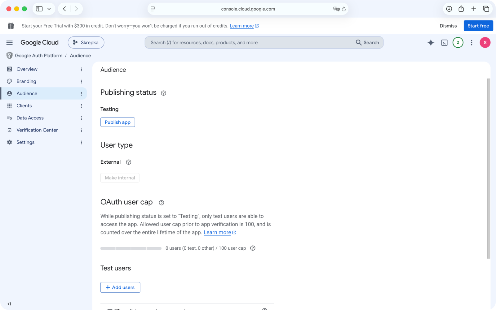

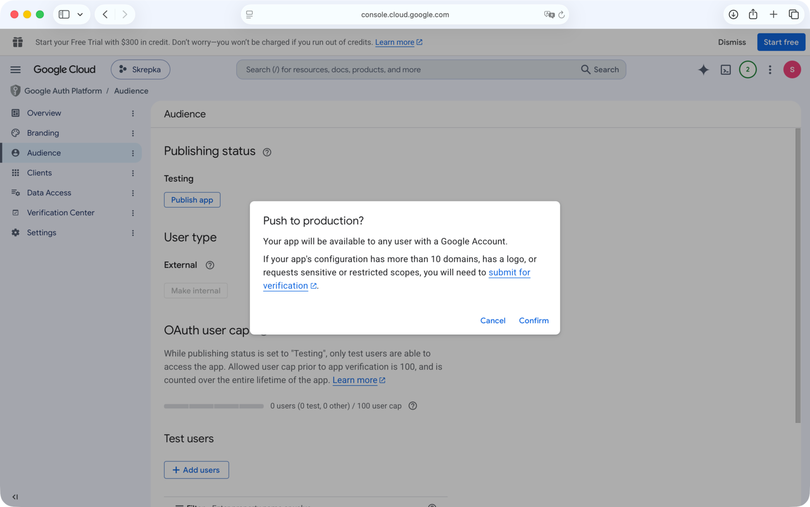

Зачем: в режиме Testing выданный вход протухает каждые 7 дней. В Production он живёт
долго, а «непроверенным» приложение при этом остаётся — для вас как владельца этого
достаточно.

### 4.4. Про плашку «требуется верификация» — игнорировать

Из-за доступа `drive` консоль будет предлагать отправить приложение на проверку Google.
Для личного использования это **не нужно** и делать этого не надо: вы пользуетесь своим
приложением сами. Единственное следствие — на шаге 6 при входе Google покажет экран
«приложение не проверено», где вы нажмёте «всё равно продолжить».

## Шаг 5. Создать OAuth-клиент (Desktop)

Слева откройте **Clients** → **Create client** → Application type = **Desktop app** →
задайте имя → **Create**.

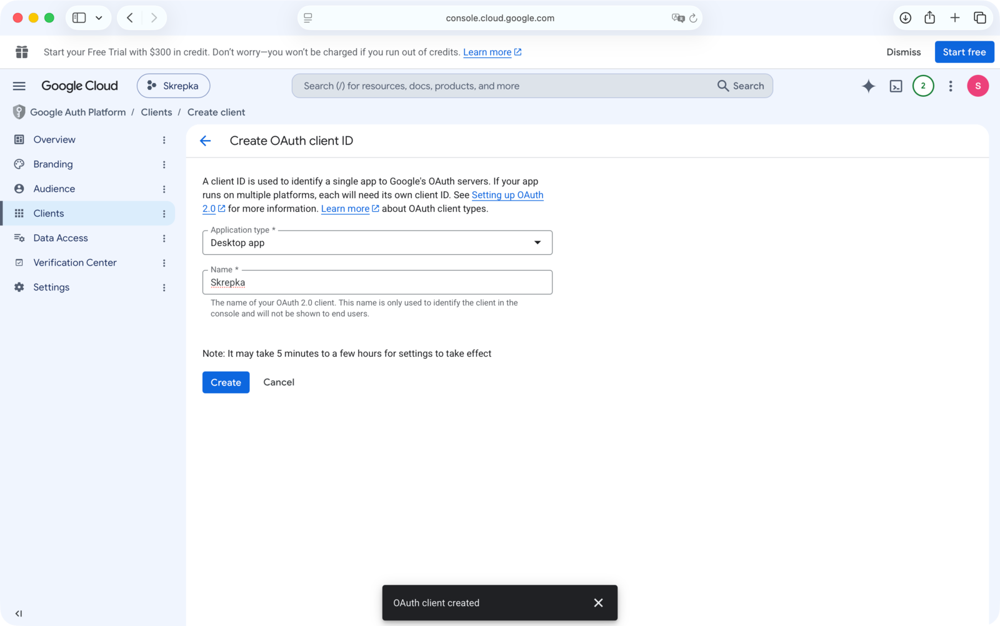

В открывшемся окне нажмите **Download JSON** — сохранится файл вида `client_secret_….json`.
Держите его в надёжном месте и **не коммитьте** в git.

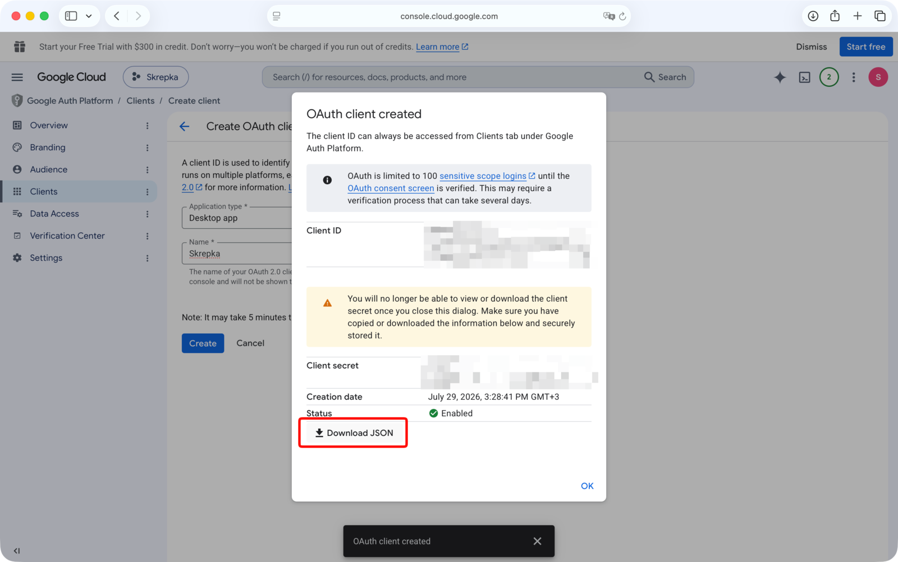

## Шаг 6. Запустить `skrepka init`

В терминале наберите команду **с пробелом в конце** и не жмите Enter:

```bash
skrepka init --credentials 
```

Затем **перетащите** скачанный `client_secret_….json` из Finder прямо в окно терминала —
путь подставится сам. Теперь нажмите Enter.

Откроется браузер для входа в Google. Вы увидите предупреждение, что приложение
**не проверено Google** — **это ожидаемо для вашего собственного клиента**. Нажмите
**Advanced** (внизу слева), затем ссылку **«Go to … (unsafe)»**. Кнопку «Back to safety»
не нажимайте — она отменяет.

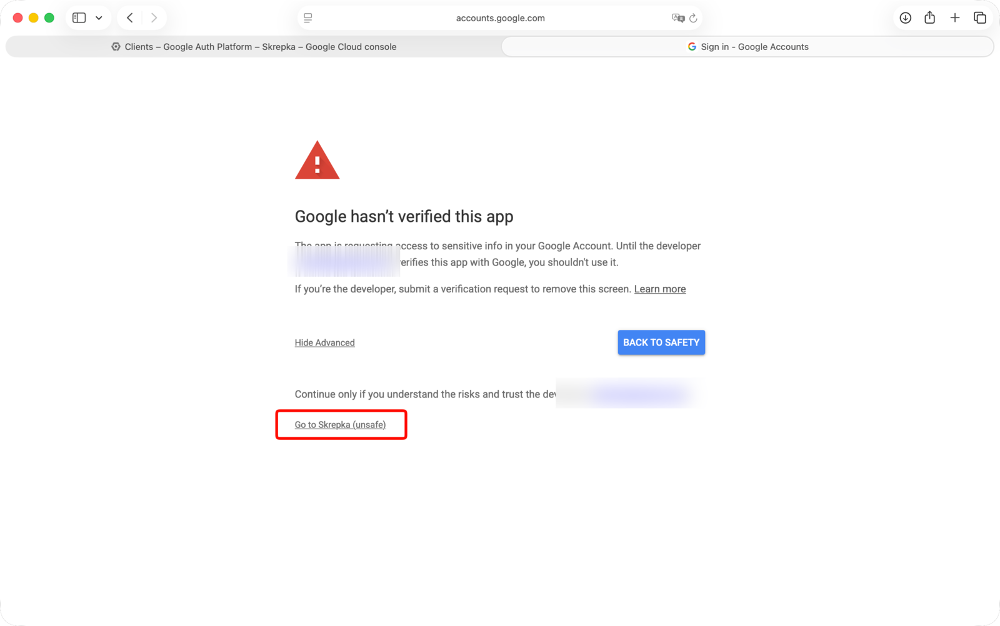

На экране согласия предоставьте запрошенный доступ (**один** пункт про файлы Google Диска)
и нажмите **Continue**.

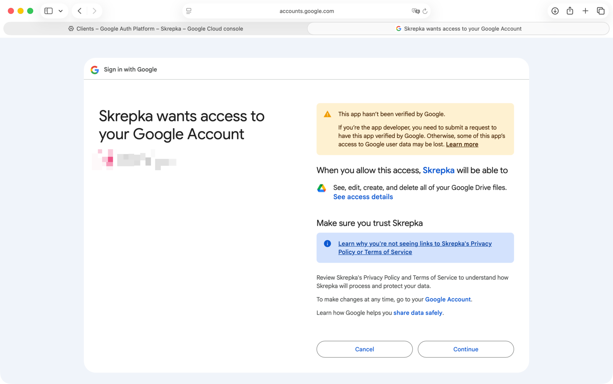

По завершении skrepka сделает smoke-тест (создаст тест-документ, добавит к нему
комментарий, приберёт за собой) и выведет `All set.` — настройка окончена.

Проверьте результат командой:

```bash
skrepka doctor
```

Все проверки должны быть `[ok]`.

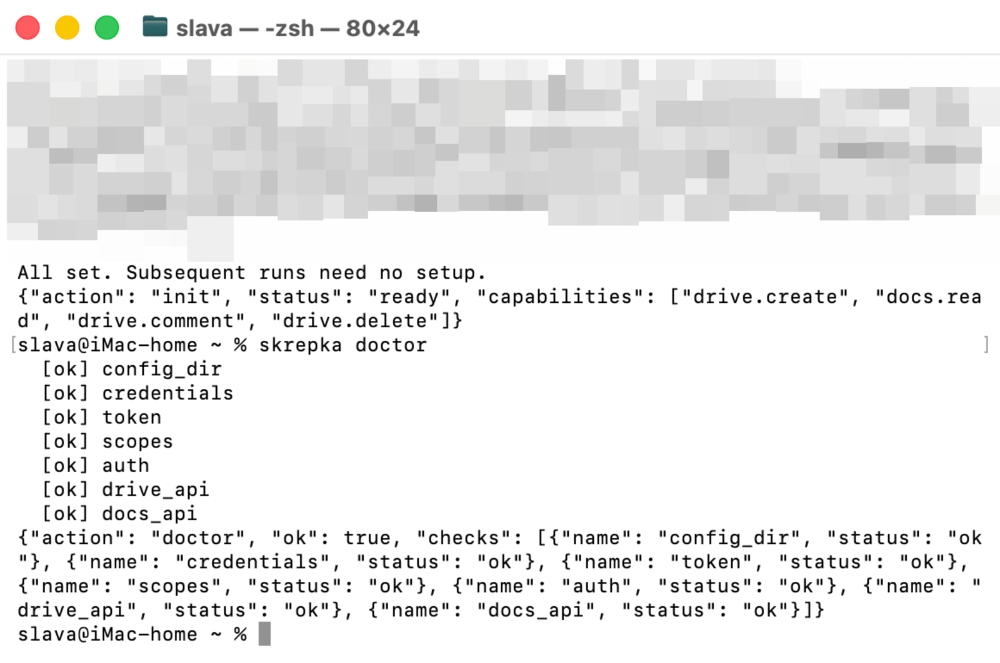

## Типичные проблемы

- **Вход протухает через 7 дней.** Значит проект остался в режиме **Testing** —
  опубликуйте его (Шаг 4.3) и выполните `skrepka init` заново.
- **«…API is not enabled».** Вернитесь к Шагам 2–3 и включите нужный API, затем
  повторите. После включения API может пройти минута-другая, прежде чем он заработает.
- **`command not found: skrepka`.** Команда не в пути — используйте полный путь, например
  `~/.local/bin/skrepka init --credentials …`.
- **Скачали не тот клиент.** Нужен именно **Desktop app**. Service-account ключ или
  Web-клиент skrepka отклонит с подсказкой.

Что происходит с вашими данными после авторизации — [PRIVACY.md](../PRIVACY.md).
Как отозвать доступ и удалить локальные данные — команды `logout` / `revoke` / `forget`
(там же).
